<H2>1. 水质VOCs在线监测微型系统</H2>

**项目简介：**

&emsp;&emsp;该项目主要是针对市场上测量水质5参数与检测特殊污染物VOCs的需求，小型化水站而开发的产品，项目选址在临安一处河域上。在河域上挖一个坑使水流平缓以及足够抽水深度，通过上位机发送指令到PLC控制抽水泵自动抽水到4平方小型站里面的沉淀池里，并让超声波进行净化，在水样静止一段时间后系统自动从沉淀池抽水样进行预处理，然后上位机发送指令让光谱检测仪表自动采取水样进行分析，分析完成后得出检测结果，上位机通过国标协议上传检测结果到平台上，并自动进行仪器仪表吹洗流程。

**个人职责：**

- 1.负责项目中的设备集成。

- 2.负责周期性检测流程的实现。

- 3.负责项目中的视频监控的集成。

**项目业绩：**

- 1.进行VOCs特殊检测的研究的协助，集成仪表自动控制。

- 2.协助处理数据分析，调整设备参数的协助。

- 3.指导其它组员的开发。

<H2>2. 公司办公审批流程开发</H2>

**项目描述：**

&emsp;&emsp;主要使用COM+，JQuery，JS技术开发审批流程系统，在实施中根据新需求作二次开发。在页面上广泛调用在服务器上布置的COM和DLL实现相应的功能。包括生成Word文档，打包大量的Word文件生成ZIP文件供下载，使用XML作为模板生成页面显示数据表格等。

**项目职责：**

- 开发审批流程。

- 引入COM+生成文件。
	       
**项目业绩：**

&emsp;&emsp;为公司开发小型审批流程，增加文件下载功能。

<H2>3. ERP订单处理系统</H2>

**项目描述：**

&emsp;&emsp;该项目主要处理销售人员销售的大配套订单，办事处把销售订单导入系统，销售清单传送技术部确定后，生产部根据销售订单处理生成生产计划，并根据实际生产状况制定发运计划。财务部门人员通过订单自动核算金额，打印订单给领导审批，生产负责人员根据生产计划打印领料单，领料生产，系统根据装箱规则打印装箱清单，装箱根据清单人员扫描货物装箱，扫描器扫描条码从服务器上布署WebService查询装箱数据，检测装箱是否完整，系统打印发货清单，发运部根据发运计划在生产完成后进行发货并打印发货清单交给财务和对方公司。财务收到发运计划和实际发运单进行开票结算，收回应收款完成一次订单。

**项目职责：**

- 1.负责订单系统全部开发。

- 2.解决XLS文件的导入问题。

- 3.跟踪核算整个订单成本流程开发。
	       
**项目业绩：**

- 1.解决销售人员大量订单处理的时间花费。

- 2.解决生产管理人员排产计划与车间和财务同步问题。

- 3.方便财务核算整个流程。

- 4.解决发货人员核对订单问题。

<H2>4. VBA生成装箱清单</H2>

**项目描述：**

&emsp;&emsp;本系统为了协助生产装箱人员解决装箱清单和工人漏装少装的问题，项目第一版本采用VBA开发，通过读取XLS订单，然后根据数据库中的装箱规则，生成每箱表头，然后读取零件数据填入整箱表格中，对于超出一页部分或者需要特殊处理的进行二箱处理，对于有其它新规则而未处理的部分提示处理人员；然后控制打印装箱清单。

**项目职责：**

- 1.负责与装箱工程技术人员了解需求。

- 2.负责总体功能的开发和清单规则的制定。

- 3.负责培训工程部门人员装箱小组的培训。

- 4.负责引用宏技术和培训技术部门员工使用VBA提高物料处理效率。

	       
**项目业绩：**

- 1.原来做一份清单需要二个多小时，现在只需要最长不超过7分钟。

- 2.得到技术中心主任以及工程技术小组的一致好评。

- 3.清单错误率由原来的经常弄错到几乎没有的质的飞跃。

<H2>5. OA协同系统上线的实施</H2>

**项目描述：**

&emsp;&emsp;OA系统是一些公司最常用的功能系统；负责审批，各类流程，公司文化传播和知识体系等功能的平台；最早系统包含Domino和Java版本二部分构成，后来为了方便管理，把Domino功能全部移植到Java版本OA上，个人主要负责部分常用办公流程表单的开发与配置。包括外来客户用餐的申请单，用餐费用的报表统计（使用润乾报表），印章刻印申请，人员出厂证表单的设计与配置，中高层季度考核报表开发，并把一些重要的数据通过MSSQL触发器和函数方法处理写到原来的SQL2005数据库中。

**项目职责：**

- 1.负责OA协同系统的报表开发。

- 2.负责人员出厂证流程的开发。

- 3.负责印章等流程的开发。
	       
**项目业绩：**

&emsp;&emsp;OA系统的开发，完成公司OA上线的一些功能完善和填充满OA功能。

<H2>6. 昆山通力装箱检测系统</H2>

**项目描述：**

&emsp;&emsp;主要负责昆山通力装箱清单明细生成，根据昆山通力产品装箱规则及订单生成装箱清单记录及清单明细。把生成的清单明细打印成清单报表。使用C#开发插件抓取网页数据，在服务器上布署WebService供车间扫描系统查询数据。并实施整个项目与培训跟踪，检测系统由手持扫描枪系统组成，在手持设备上开发扫描软件，扫描到零件物料码条码比对，然后放入到对应箱里，打码装完后打印箱外条码粘贴在箱外供客户扫描查询和进入客户系统一一匹配。

**项目职责：**

- 1.负责软件的全部功能开发。

- 2.负责WebService的接口开发。

- 3.解决顾客系统订单无法直接录入到我司系统的问题。
	       
**项目业绩：**

- 1.解决与顾客系统对接问题；

- 2.解决装箱少装多装零件的问题；

- 3.使得生产数字化。

<H2>7. 表情识别分类与控制系统</H2>

**项目描述：**

&emsp;&emsp;通过摄像头捕捉定位人脸，多个人出现时锁定其中靠近最近的识别度最好的(目前受灯光干扰以及未进行活体检测，有部分误识别和假识别，此问题正在改进算法处理中以提高准确度)，把检测到的人脸框内图像数据传送到微表情识别服务里进行表情分析(微表情识别采用人工智能模型框架卷积神经网络中的主流框架mini_XCEPTIO及循环神经网络RNN，通过Adam算法训练了7个表情{微表情就是面部表情分类，7种表情同时存在，其中概率最高的作为识别结果}总共35000多张图片数据，目前主流的微表情识别率大致在0.66左右，训练出最好的模型识别率在0.7左右，我们自己训练的在0.601左右，目前缺乏图片数据和机器的大规模学习以及模型精度不高导致识别效果并不良好，部分表情需要做出有明显特征的才能识别出来，像厌恶和惊恐的识别度只有0.25都不到)，把分析得出的结果映射到不同通道发送给胶囊传送硬件服务，胶囊硬件服务接收到结果后推送出对应气味胶囊。

**项目职责：**

- 1.负责硬件服务端的开发。

- 2.负责表情识别分类训练。

- 3.Caffe模型的引入加深人脸裁剪精度，优化人脸识别和人脸切割算法。

- 4.优化软件图片处理性能。
	       
**项目业绩：**

&emsp;&emsp;已经作为销售胶囊的一种吸引性营销手段，为公司销售几千份胶囊。

**项目UI：**

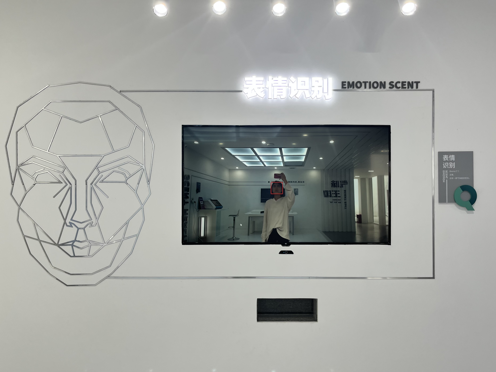

<H2>8. Telescent系统</H2>

**项目描述：**

&emsp;&emsp;本系统通过机器狗(或者无人机)上的摄像头捕捉视频画面上的花草树木物品等，目前通过百度图像识别出图像上特征最明显的物品，并匹配气味库，匹配到气味库的气味返回通知324路设备端，设备端接收到气味标识数据，播放相应的气味。

**项目职责：**

- 1.负责对接无人机系统，机器狗摄像头系统。

- 2.调用百度动植物系统接口识别摄像头。

- 3.识别匹配气味库气味并播放。
	       
**项目业绩：**

&emsp;&emsp;作为公司的宣传展示气味有比较好的结合应用，在山东山亭县乡村项目演示展览。

**项目UI：**

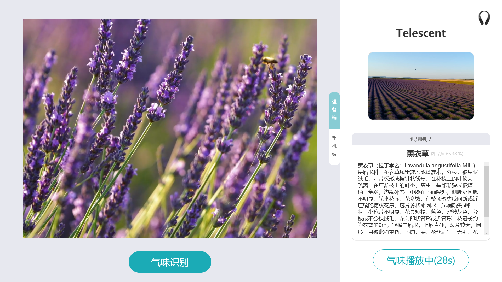

<H2>9. BrainCo冥想系统</H2>

**项目描述：**

&emsp;&emsp;此套设备是与强脑科技合作的用于瑜伽、自我冥想、安定等作用的辅助设备，强脑科技的FocusZen正念舒压系统采集人体脑电波(实际上可能是通过人体表皮微电流或者检测神经传导微电流原理实现采集人体数据，实验测试只要手指或者金属导体连接三个接触点就能工作，介绍时按官方统一介绍)传送检测数据到气味小播服务端，平板上的软件根据检测数据分类(活跃，安静，入定等5个状态，数值越小越活跃)自动播放轻音乐，并通过蓝牙模块控制气味小播播放不同辅助气味以帮助用户进入入定状态，辅助用户身心得到解压放松和聚神的状态，可以很好的用于冥想等瑜伽课上。

**项目职责：**

- 1.负责前端页面展示。

- 2.负责获取脑电数据。

- 3.播放和控制蓝牙低功耗设备产品。
	       
**项目业绩：**

&emsp;&emsp;成功应用冥想相关产品，已经得到一些顾客和学校师生的青睐。

**项目UI：**

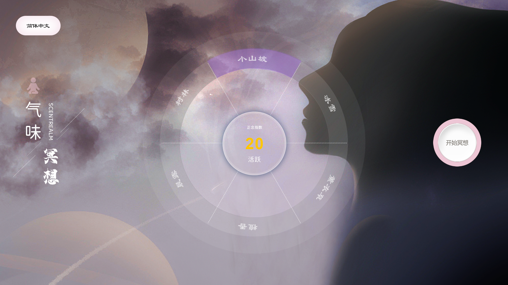

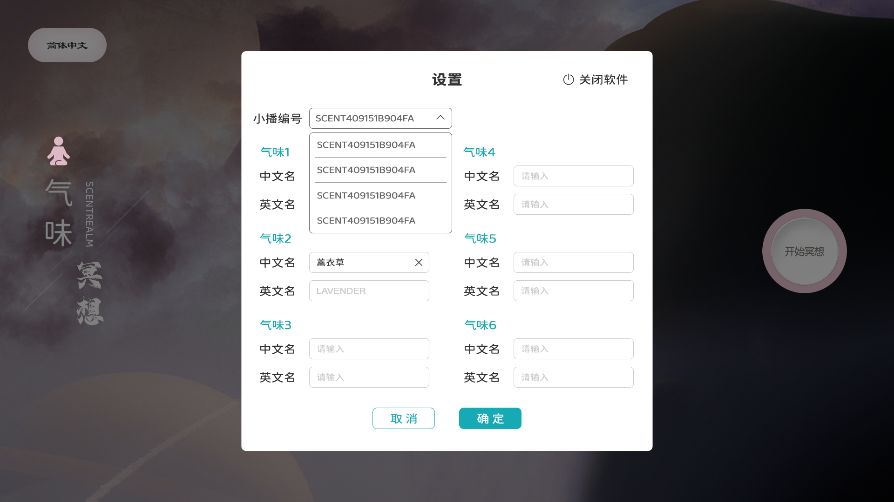

<H2>10. 气味儿童教育机</H2>

**项目描述：**

&emsp;&emsp;该项目主要针对儿童和青少年体验用的教育机，软件主页罗列了常见的水果和食物等，小朋友点击对应的食物或者水果，设备自动播放对应的水果的介绍，然后播放对应的气味，小朋友在了解对应水果之类的同时又能闻到其气味，加深了认识和记忆，以后可以很容易辨别出碰到的水果，特别是一些不常用的香气可以加深印象。

**项目职责：**

- 1.负责软件开发,MVVM模式。

- 2.引导培训用户使用。

- 3.优化体验，增加文转语功能。
	       
**项目业绩：**

&emsp;&emsp;在一些展览馆上有应用，吸引了比较多的儿童和青少年用户，特别一些比较不常见的气味在此可以体验，淄博科技馆等一些场馆使用了这些设备。

**项目UI：**

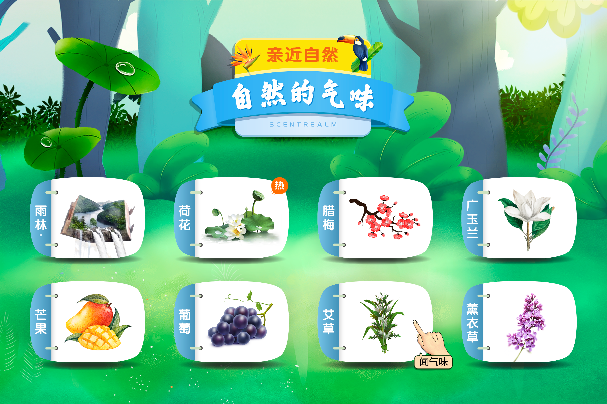

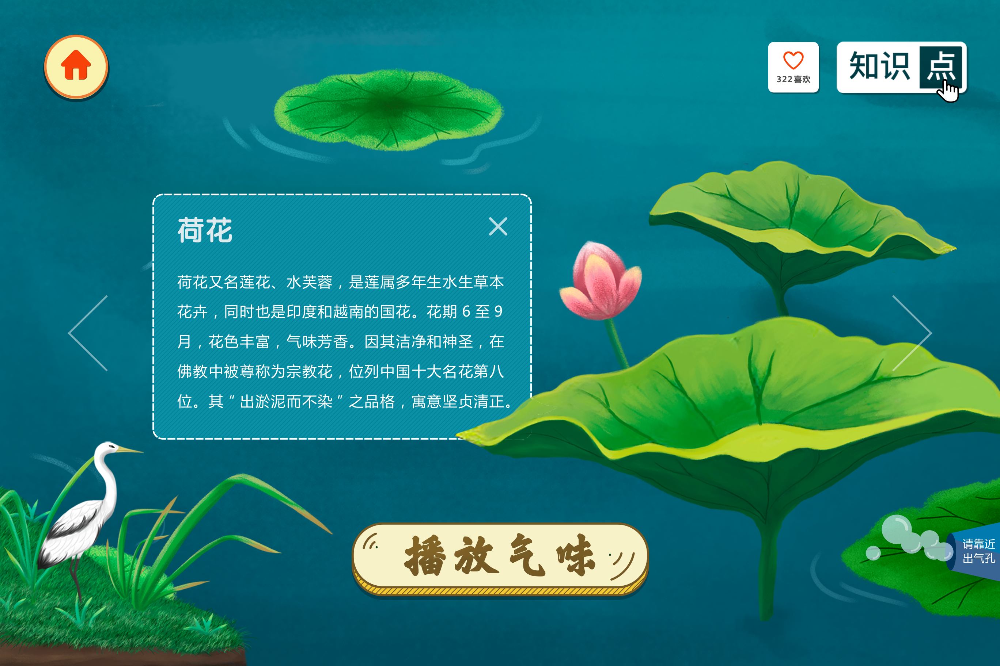

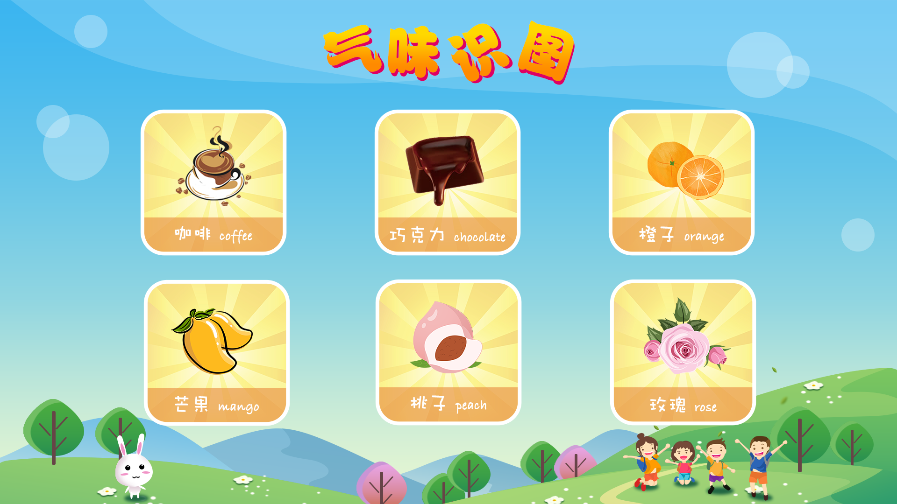

<H2>11. 党建广告机系列</H2>

**项目描述：**

&emsp;&emsp;广告机是比较常用的宣传方式，本项目是针对党建特别需求设计的广告宣传系统。在大部分广告机上没有特别的表现呈现方式上增加了气味，使得党建宣传有更特别的宣传方式，政府领导领导在体验后有很深的印象，纷纷表示赞赏，后面浙大院校庆祝成立也采用此种方式，央视网专门采购了些作为党建宣传。

**项目职责：**

- 1.负责软件开发，MVVM框架，引入VLC播放器。

- 2.设计模板化，可以配置视频适合多种用户需求。

- 3.集成气味播放模块，自动连接设备。

**项目业绩：**

&emsp;&emsp;得到政府领导的广泛好评，多个横向应用得到发展。

**项目UI：**

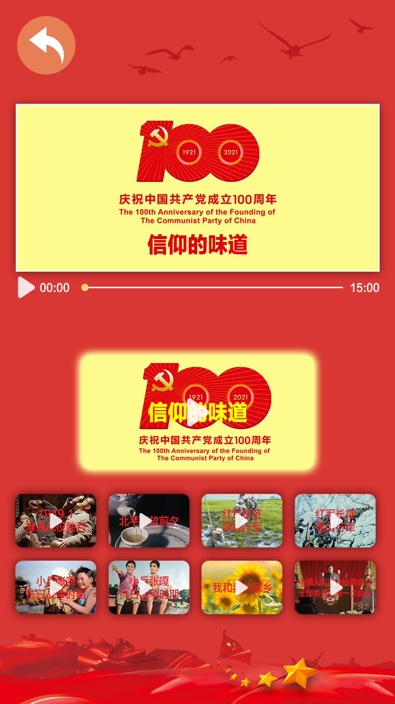

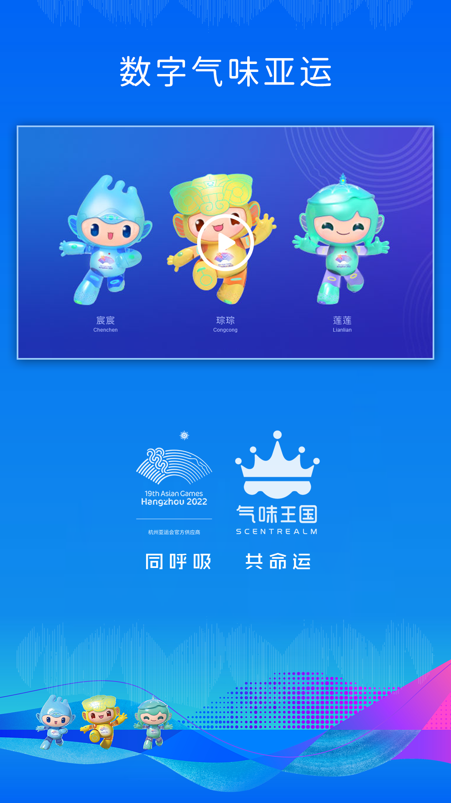

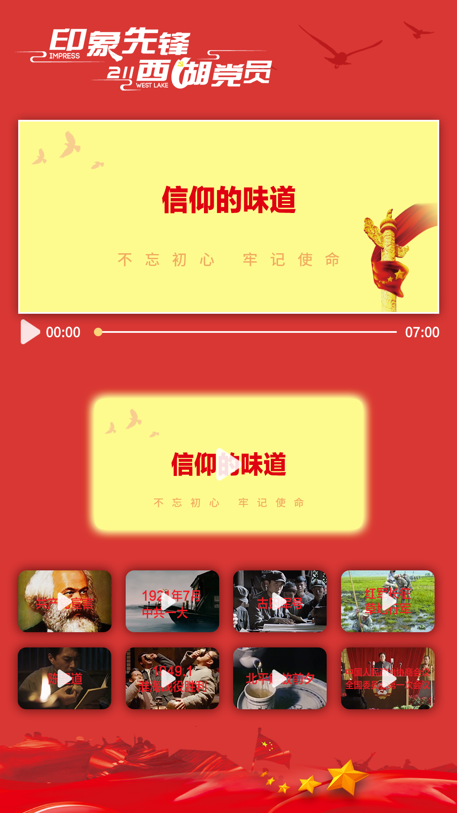

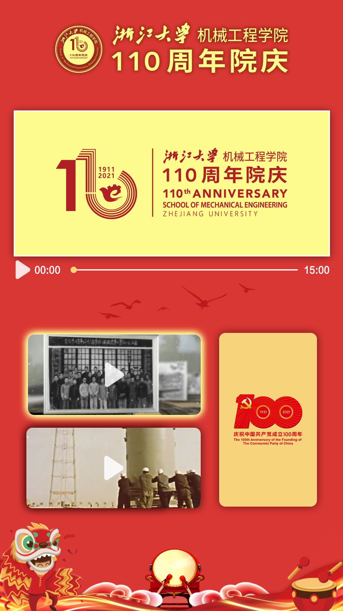

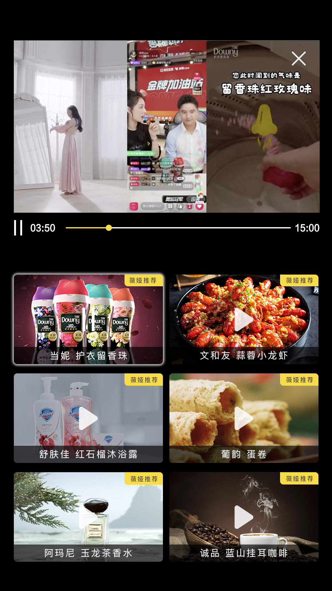
