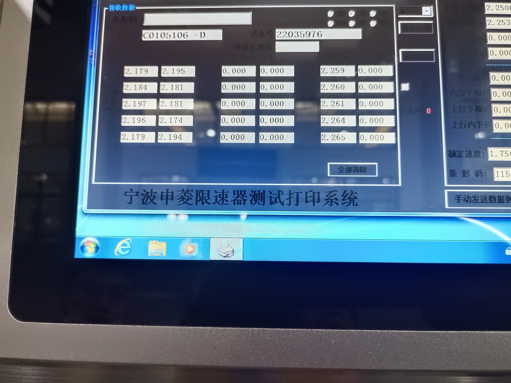
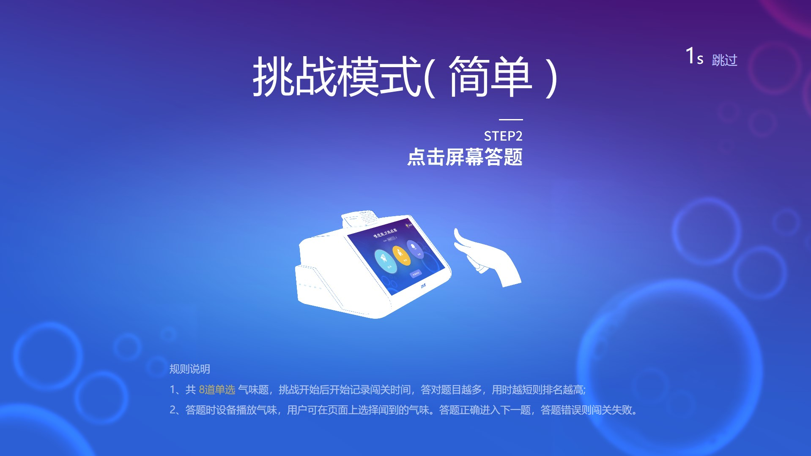
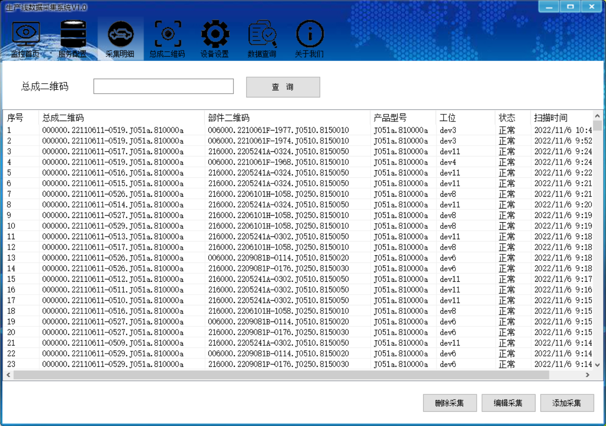
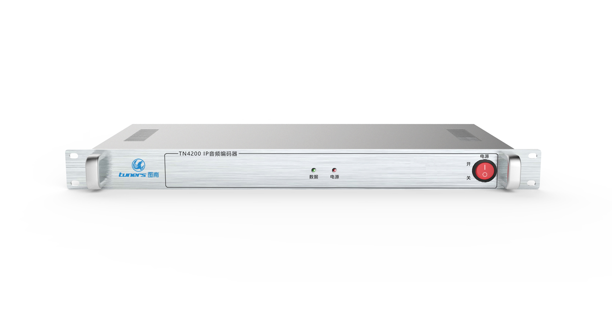
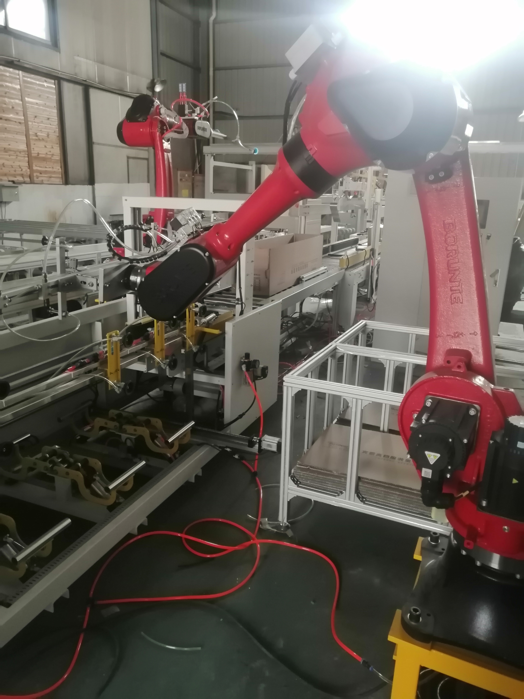

<H2>1. 水质VOCs在线监测微型系统</H2>

**项目简介：**

&emsp;&emsp;该项目主要是针对市场上测量水质5参数与常见测量因子的需求小型化而开发的产品。本人负责软软件开发，产品集成希思迪常见因子测量仪器，通过PLC上接入的液位传感器判断河水是否有排污的，软件控制PLC上的水泵与阀进行采样处理，然后把处理的水样注入到分析仪表中进行测量，软件系统控制分析仪表进行分析处理，对系统分析仪表进行标定等复杂操作，对获取测量数据与分析过程数据保存。系统还集成了海康的视频监控系统作为安全设备。新设计软件UI风格与框架，使得风格界面更加美观。

**个人职责：**

- 1.负责项目的总体设计，及核心技术：流程引擎的设计与实现

- 2.负责顾客无预定入住流程及退房流程的开发

- 3.负责项目中关键性技术的攻关开发及优化
	       
**项目业绩：**

- 1.与1.0版本的自助机相比，产品更可靠，外观更美观，实现了7*24小时的不间断运行

- 2.引入和使用的流程引擎提高了25%以上的开发效率

- 3.与一代产品相比，一代自助机产品日均使用率100单不到跨越到二代自助机使用率日均10000单以上，完全淘汰一代产品

- 4.已经服务超过100万旅客；简化流程，大大减少工作量，60人团队入住仅需15分钟，效率大幅提升；前台业务24小时自助办理，小酒店无人化管理，大酒店精细化管理。

**项目UI：**

<H2>2. 公司办公审批流程开发</H2>

**项目描述：**

&emsp;&emsp;主要使用COM+，JQuery，JS技术开发审批流程系统，在实施中根据新需求作二次开发。在页面上广泛调用在服务器上布置的COM和DLL实现相应的功能。包括生成Word文档，打包大量的Word文件生成ZIP文件供下载，使用XML作为模板生成页面显示数据表格等。

**项目职责：**

- 项目经理；
- 负责UI新框架的开发；
- 协调测试人员集成自产仪器的测试工作；
- 协调开发人员开发集成其它设备；
- 协调电控设计人员进行产品控制对接。
	       
**项目业绩：**

&emsp;&emsp;上位机软件进行UI新版本的全面升级，集成海康视频安防监控系统，集成门禁系统，作为新一代产品销售，优化部分组件平台性能，以及整理成模块块方便其它项目上使用。

**项目UI：**

<H2>3. ERP订单处理系统 OA系统实施与二次开发</H2>

**项目描述：**

&emsp;&emsp;该项目主要处理销售人员销售的大配套订单，办事处把销售订单导入系统，销售清单传送技术部确定后，生产部根据销售订单处理生成生产计划，并根据实际生产状况制定发运计划。财务部门人员通过订单自动核算金额，打印订单给领导审批，生产负责人员根据生产计划打印领料单，领料生产，系统根据装箱规则打印装箱清单，装箱根据清单人员扫描货物装箱，扫描器扫描条码从服务器上布署WebService查询装箱数据，检测装箱是否完整，系统打印发货清单，发运部根据发运计划在生产完成后进行发货并打印发货清单交给财务和对方公司。财务收到发运计划和实际发运单进行开票结算，收回应收款完成一次订单。OA系统二次开发包括外来客户用餐的申请单，用餐费用的报表统计（使用润乾报表），印章刻印申请，人员出厂证表单的设计与配置，中高层季度考核报表开发，并把一些重要的数据写到原来的SQL2005数据库登记。

**项目职责：**

&emsp;&emsp;负责生产线的测试数据采集软件开发，箱外标识打印软件的开发，仓储分配的算法开发及控制的开发，设备控制协议的指定。
	       
**项目业绩：**

原来生产线产量80台/人天变成120台/人天，测量数据可追溯，产品出厂质量由原来的98%变成99.99%，工厂信息化水平从0到1，实现产品信息可追溯化，标签系统方便仓库自动管理，信息化管理，目前该测试能软件已经稳定运行达10年并持续为公司生产服务。

**项目UI：**

<H2>4. 生成清单报表开发</H2>

**项目描述：**

&emsp;&emsp;本系统专门为了公司气味电影产品所做的脚本编辑器，主要通过结合菜单模块控件，气味库控制，视频播放，气味脚本编辑控件，提供可视化编辑器，在播放视频时，拖动脚本到时间轴上，触发底层集成的设备自动播放对应气味，编辑完成后，导出视频与脚本提供给气味播放器播放，并可以实时对摄像头采集的视频进行图片识别，识别到与气味库相关的气味可以自动播放，目前可使用机器狗或者无人机采集到远处的花草树木等视频和识别播放气味。技术中心工业工程部生成清单系统开发

**项目职责：**

- 1.负责框架结构设计，UI组件设计开发，底层设备控制模块的架构开发。

- 2.负责通信协议的制定，协助设备组装人员测试硬件性能。

- 3.负责后期结合扫码付费使用接口和摄像头采集视频识别功能的集成。

	       
**项目业绩：**

&emsp;&emsp;作为公司的最常用的工具软件和底层架构，为其它项目节省开发时间和模块的支持。

**项目UI：**

<H2>5. OA协同系统上线的实施与相关表单开发与配置</H2>

**项目描述：**

&emsp;&emsp;负责部分常用办公流程表单的开发与配置。包括外来客户用餐的申请单，用餐费用的报表统计（使用润乾报表），印章刻印申请，人员出厂证表单的设计与配置，中高层季度考核报表开发，并把一些重要的数据写到原来的SQL2005数据库登记。

**项目职责：**

- 1.负责软件的全部功能开发。

- 2.负责气味电影新版本控制器的集成。
	       
**项目业绩：**

&emsp;&emsp;作为公司的最核心产品的软件部分方便结合硬件设备成套销售或者租借的软设施。

**项目UI：**

<H2>6. 昆山通力装箱检测系统</H2>

**项目描述：**

&emsp;&emsp;主要负责昆山通力装箱清单明细生成，根据昆山通力产品装箱规则及订单生成装箱清单记录及清单明细。把生成的清单明细打印成清单报表。使用C#开发插件抓取网页数据，在服务器上布署WebService供车间扫描系统查询数据。并实施整个项目与跟踪，协调外包人员与车间实际应用工人的应用。检测系统由手持扫描枪系统组成，这部分外包给苏州慧百科技。

**项目职责：**

- 1.负责软件的全部功能开发。

- 2.负责与中科院功能需求的对接。

- 3.负责与平台端的对接接口数据。
	       
**项目业绩：**

&emsp;&emsp;作为公司第一次与中科院合作的产品，也是第一次进入医疗相关的领域有很大的意义，目前已经有部分产品已经使用中，也是作为中科院研究的辅助器材，对于个人来说是医疗领域的自助机开发。

**项目UI：**

<H2>6. 产品装箱清单的生成</H2>

**项目描述：**

&emsp;&emsp;负责装箱清单的自动化生成，减少办公人员手工制作装箱清单的工作量，主要对产品装箱进行装箱算法，然后把相应的产品根据装箱分配箱号分配到实际装箱里去，在EXCEL中用VBA宏把生成的清单保存成EXCEL文件作为电子清单。升级使用VB6.0读取Excel内的数据并创建Excel操作Excel生成清单，并把生成的清单保存到数据库中去。

**开发环境：**

- 开发工具：VS2022/ VS2019
- 数据库：MySQL，SQLite
- 部署环境：Win7和Win10工控机

**项目职责：**

- 1.负责软件的UI开发。

- 2.负责设备集成与业务逻辑开发。

- 3.负责排名等算法的设计。
	       
**项目业绩：**

&emsp;&emsp;作为公司展厅比较吸引顾客的一个项目，是用户度最集中喜爱的一个项目。

**项目UI：**

<H2>7. 空调零件装配检测系统</H2>

**项目描述：**

&emsp;&emsp;本系统为工厂生产空调工艺防止少装漏装零件的监控系统，通过PLC采集每个零件的二维码，每个工位安装的顺序和工序零件，在生产完全时判断是否有漏装或者错装的零件，并生成二维码，方便用户追溯以及信息化管理，其中每个工位至少有个PLC，一个工位可以安装多个零件或者多道工序，通过在系统配置生成每条生产线需要安装的零件和每个工位需要处理的工艺，完成设备总装检测，用户把打印出来的二维码贴在安装成的空调合格标志上。

**开发环境：**

- 开发工具：VS2022/ VS2019 C#
- 数据库：MySQL
- 部署环境：Win7工控机、Win10

**项目职责：**

- 1.负责服务端的开发，PLC设备的集成。

- 2.负责工位工艺配置逻辑业务的开发以及数据的查询。
	       
**项目业绩：**

&emsp;&emsp;已经正常运行5年，监控生产运行100万台以上空调，方便车间工厂改动工序和追溯产品相关信息。

**项目UI：**

<H2>8. 气味涡环炮</H2>

**项目描述：**

&emsp;&emsp;本系统通过摄像头捕捉人脸(目前使用Caffe模型提高了人脸识别准确度，能适应比较差的环境)，根据人脸(多个人脸时锁定距离近，识别度比较高的的一个)对应在摄像头位置发送指令调整机器对准人脸，不断校准人物所在摄像头方位，计算分析出目标比较稳定时发送指令控制设备生成气味涡环，喷发具有涡环状的气味来吸引经过店铺门口的用户。

**开发环境：**

- 开发工具：VS2022/ VS2019
- 数据库：SQLite
- 部署环境：Win7工控机、Win10工控机

**项目职责：**

- 1.负责人脸识别，定位算法，设备控制的开发。

- 2.负责第二版本技术原理改进优化及部署设计。
	       
**项目业绩：**

&emsp;&emsp;作为公司的最核心产品之一，新开发产品中唯一有专利权的项目，在展会上吸引很多用户的青睐。

**项目UI：**

<H2>9. IP广播系统</H2>

**项目描述：**

&emsp;&emsp;该项目主要针对江西省某县级广播系统的平台改造，重新开发适用于现代广播系统的平台，与广电总局合作的广播系统试点项目。使用C#开发的TCP伺服服务可以同时接收6000多个音柱设备的实时状态信息，并实时显示在离线地图上(Gmap.Net),系统同时开启TCP监听服务监听市平台的应急广播消息(包括语音文件，短信息包，视频文件，XML指令包等打成的Tar包)，通过串口发送指令到信号发射器控制下端智能音柱开启接收频道，实时播放语音音频流到TCP音柱或者信息转语音流(文字信息通过文转语模块/调用Windows文转语播放音频)或者播音员实时播放音频到音柱。

**开发环境：**

- 开发工具：VS2013
- 数据库：MySQL，MSSQL等
- 部署环境：Windows server 2008服务器

**项目职责：**

- 1.负责伺服服务及播放服务软件开发。

- 2.负责气味电影新版本控制器的集成。

- 3.服务器部署，IP网络管理
	       
**项目业绩：**

&emsp;&emsp;成功应用到村村通试点项目，并得到省市领导的肯定，方便下一阶段的推广应用。

**项目UI：**

<H2>10. 布料包装系统</H2>

**项目描述：**

&emsp;&emsp;该项目主要针对原有车间布料包装生产线进行自动化改造的。通过验布人员验布并确认布的质量，录入到系统中然后上线到包装线，服务端接收到4条生产线的上线布料信息累积起来，当某条生产线某个批次达到整箱包装要求时，服务端通知PLC某条线上线布料进行包装，并打印布料整箱信息，PLC接收指令，每上一个布料卷就通知服务端打印对应布料的二维码，PLC接收到二维码打印成功的消息后包装布料并自动把二维码贴在布料上，当包装完整箱后，线上系统的机器人接收服务端传过来的布料整箱消息进行打包和封装，并把包装好的箱子传送到码垛机器旁，码垛机接收到到位开关消息和整箱的生产线号数据分配码垛，服务端接收到码垛完成整垛信息后打印对应清单。

**开发环境：**

- 开发工具：C# VS2022
- 数据库：MySQL，Dapper等
- 部署环境：Windows server 2008服务器

**项目职责：**

- 1.负责服务软件开发。

- 2.负责部署网络配置，协助PLC工程师调试连通。

- 3.客户端软件的开发，仓库管理软件开发。
	       
**项目业绩：**

&emsp;&emsp;成功应用到客户生产中，将原来手工包装布料自动化，信息化，方便追溯记录。

**项目UI：**

<H2>11. 黑电台监控系统</H2>

**项目描述：**

&emsp;&emsp;该项目主要是针对城市区域内一些非法电台的。通过在城市区域内投放监控设备，并在地图组件上显示(Gmap.Net)，设备采集各个频道的频谱数据和音频数据，监听播放PCM流数据；使用4G模块通过TCP上传到服务端，服务端解析频谱数据分析异常并保存，同时另一服务监听音频，使用语音转文字(科大讯飞)自动过虑异常信息，并在地图上显示各个点的监控状态，对产生的异常生成报警。针对这个项目，专门设计架构了一个服务端，服务端由音频处理模块，日志模块，通信模块，用户模块，业务处理模块，JSON模块等组成，业务处理模块把各个功能模块联接起来。黑电台综合网络查找系统是通过对某一城市或特定区域布置多个小型“无线电采集终端”，对广播频段进行重点监测，可以实时高效的查找非法黑电台，对查找出来的非法频率信号进行实时比对，对解调出来的音频数据进行实时记录，可快速的查找、分析并判断黑电台的存在，有效的提高了查找黑电台的技术手段，摆脱了传统监测设备的局限，有效避免传统监测设备不灵活的特性，从而将对“黑广播”侦测由被动变为主动，有效提高了工作效率。

**开发环境：**

- 开发工具：C# VS2010
- 数据库：MySQL等
- 部署环境：Windows server 2008服务器

**项目职责：**

- 1.负责服务端软件开发。

- 2.负责部署设备网络配置，以及监控设备的配置。

- 3.客户端软件的开发。
	       
**项目业绩：**

&emsp;&emsp;作为监控非法广播的服务应用于广播电视部门的探测系统，成为监测到南京某地的一些黑电台。

**项目UI：**

