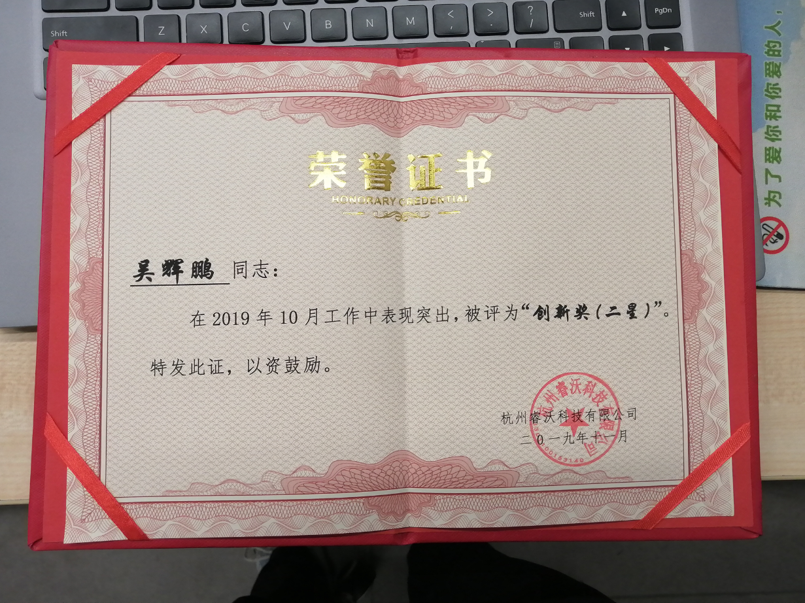

#**个人历年项目总结**

--------

<H2>1. 酒店自助机终端系统</H2>

**项目简介：**

&emsp;&emsp;酒店自助机终端系统是为了方便酒店客户自助入住的终端系统，可以不用前台工作人员帮助下自助完成入住。顾客可以手机上预定在自助机终端上使用身份证或者电话号码查询PMS系统上的订单，顾客自己选择房间以及通过公安PSB系统人脸核验(或者使用电子身份证)，并在扫码支付或者人脸支付或者插卡支付完成后得到门卡，顾客拿着门卡就可以自行找到房间入住。顾客也可以在无预定的情况下自行进行查询是否有可住房间进行输入住。还可以进行团体预定入住，根据提示每个房间住多少人，通过当地公安系统核验入住。顾客在第二天可以自行插入门卡进行退房办理以及扫码开电子发票。或者插入门卡查询入住房间信息进行续住流程。

**个人职责：**

- 1.负责项目的整体构架设计以及核心流程引擎的设计与实现，方便实现酒店入住业务逻辑动态变换调整。全程参与，重点架构开发，设备抽象接口化。

- 2.负责部分PMS系统对接(Restful风格的WebAPI对接，异步请求)，门锁对接，人脸支付以及扫码支付功能对接和部分公安PSB系统的核验对接(使用ActiveMQ消息通知)。

- 3.负责项目中引入StyleCop.Analyzers进行代码整齐规范，检查开发人员代码规范，以及指导组员进行规范开发。

- 4.负责项目中日志系统选型，以及ELK日志系统搭建测试和配置上线，以及本地NLog的配置方法。

- 5.解决第三方门锁SDK崩溃问题，使用单独进程包装进行；解决特殊门锁协议，Wireshark抓包分析和构建协议。

- 6.指导初级工程师集成门锁开发和其它开发人员代码走读。

- 7.培训工程人员以及现场指导落地安装；解决某次设备安装问题(获得工程奖奖励一个茶杯)。

- 8.预定入住和退房流程和开发，首页XAML模板化开发。

- 9.优化软件性能，解决文转语模块长时间运行内存出现异常的问题。

**项目业绩：**

- 1.与1.0版本的WinForm自助机相比，产品更可靠，外观UI更美观，实现了7*24小时的不间断运行。

- 2.开发的流程引擎提高了25%以上的开发效率，后期只需要配置就可以完成业务调整。

- 3.与一代产品相比，一代自助机产品日均使用率100单不到跨越到二代自助机使用率日均10000单以上，完全淘汰一代产品。

- 4.已经服务超过100万旅客；简化流程，大大减少酒店前台工作量，60人团队入住仅需15分钟，效率大幅提升；前台业务24小时自助办理，小酒店无人化管理，大酒店精细化管理。

- 5.个人获得公司创新荣誉证书。

**项目UI：**

<H2>2. 水质在线监测系统</H2>

**项目描述：**

&emsp;&emsp;水质在线监测系统主要用于环保部门，是一个以在线分析仪表和实验室研究需求为服务目标，对区域内的河流，水库，排水系统，湖泊等水系进行环境监测进行实时监测的一套系统。主要测量水质pH,电导率,溶解氧,浊度,温度等五参数以及有毒污染元素和重金属元素(包括总磷，总氮，氨氮，高锰酸盐等100多种污染元素)，运用自动控制技术，组成一个从取样，预处理，分析到数据处理及远程传输数据及报警的完整系统。该项目主要是针对原来旧版本UI进行重新设计开发以及集成安防摄像，门禁系统，优化控制逻辑和集成新设备和通信协议的项目。

**个人职责：**

- 1.项目经理，项目按照IPD开发流程进行各个阶段的项目书编写及组织项目各个环节评审；
- 2.负责外部UI设计师的设计与内部评审工作；
- 3.UI新框架的开发；
- 4.集成海康摄像头监控系统，进行巡检与抓拍录像安全异常事件并通知平台；
- 5.集成刷卡门禁系统，对非法进入进行标志，触发海康监测系统拍照保存；
- 6.协调测试人员集成自产仪器的测试工作；
- 7.协调开发人员开发集成其它设备；
- 8.协调电控设计人员进行产品控制对接；
- 9.指导其它开发人员开发使用自定义控件和其它设备集成开发。
	       
**项目业绩：**

&emsp;&emsp;上位机软件进行UI新版本的全面升级，集成海康视频安防监控系统，集成门禁系统，作为新一代产品销售，优化部分组件平台性能，以及整理成模块块方便其它项目上使用。

**项目UI：**

<H2>3. 限速器测试及打印装箱系统</H2>

**项目描述：**

&emsp;&emsp;该项目主要是针对公司限速器生产线进行简单MES系统进行初步改造的，使得限速器生产线半自动化和数字化。限速器设备生产上线组装半成品后扫码获取MES系统中设立的国家行业标准数据进行速度测试和拉拔力测试，根据测试数据动态调整限速器设备性能指标到符合国家行业标准，调试完成后保存整个限速器设备的测试数据到MES系统和ERP相关系统中，在下步工序中调用调试测试的有效数据打印铭牌，打印测试报名，以及打印条码供各个生产相关人员查询追溯数据，最后在流水线末端，系统发送指令通知仓储机器爪结构抓取设备，获取设备分配仓库位置，自动把设备存储在对应货架上，需要出货时在ERP系统中发出出库指令，机器爪自动依序提出设备到打包装箱流水线。目前系统已经正常运行10多年，还在作为产线主要核心正常使用。

**项目职责：**

- 1.负责与自动化工程师制定PLC控制协议；
- 2.负责生产线的测试数据采集软件开发；
- 3.箱外标识打印软件的开发，仓储分配的算法开发及控制的开发。
- 4.解决单次PLC未上传数据或者网络异常保存测试数据异常的再次保存。
	       
**项目业绩：**

- 1.原来生产线产量80台/人天变成120台/人天；
- 2.测量数据可追溯，产品出厂质量由原来的98%变成99.99%；
- 3.工厂信息化水平从0到1，实现产品信息可追溯化；
- 4.标签系统方便仓库自动管理，信息化管理；
- 5.目前该测试能软件已经稳定运行达10年并持续为公司生产服务；
- 6.获得日立，通力电梯等公司的认可和额外订单。

**项目UI：**

<H2>4. 气味电影脚本编辑器</H2>

**项目描述：**

&emsp;&emsp;本系统专门为了公司气味电影产品所做的脚本编辑器，主要通过结合菜单模块控件，气味库控制，视频播放，气味脚本编辑控件，提供可视化编辑器，在播放视频时，拖动脚本到时间轴上，触发底层集成的设备自动播放对应气味，编辑完成后，导出视频与脚本提供给气味播放器播放，并可以实时对摄像头采集的视频进行图片识别，识别到与气味库相关的气味可以自动播放，目前可使用机器狗或者无人机采集到远处的花草树木等视频和识别播放气味。

**项目职责：**

- 1.负责框架结构设计，UI组件设计开发，底层设备控制模块的架构开发。

- 2.负责通信协议的制定，协助设备组装人员测试硬件性能。

- 3.负责后期结合扫码付费使用接口和摄像头采集视频识别功能的集成。

	       
**项目业绩：**

&emsp;&emsp;作为公司的最常用的工具软件和底层架构，为其它项目节省开发时间和模块的支持。

**项目UI：**

<H2>5. 气味电影播放器</H2>

**项目描述：**

&emsp;&emsp;本系统专门播放气味电影而开发的气味电影播放器，适用于各大影城播放气味电影，增加电影维度从3D到4D的过程。

**项目职责：**

- 1.负责软件的全部功能开发，视频流播放器。

- 2.负责气味电影新版本控制器的集成。

- 3.VLC流媒体服务搭建。
	       
**项目业绩：**

&emsp;&emsp;作为公司的最核心产品的软件部分方便结合硬件设备成套销售或者租借的软设施。

**项目UI：**

<H2>6. 科嗅仪</H2>

**项目描述：**

&emsp;&emsp;本系统专门为中科院定制的嗅觉检测终端设备，根据嗅觉功能评估标准，病人在测试系统中完成嗅觉题目的测试和生活习惯的登记，由医生根据用户测试结果和病人生活习惯评估用户的嗅觉能力，医生以此作为治疗依据进行嗅觉障碍进行医疗，此测试结果可以作为嗅觉核查的重要参考依据。

**项目职责：**

- 1.负责软件的全部功能开发。

- 2.负责与中科院功能需求的对接。

- 3.负责与医院的HIS系统对接上传测试结果，使用RestFull风格的WebAPI接口，加密校验上传数据。

- 4.引用和自定义设计步骤组件，头部组件，打印报告组件。
	       
**项目业绩：**

&emsp;&emsp;作为公司第一次与中科院合作的产品，也是第一次进入医疗相关的领域有很大的意义，目前已经有部分产品已经使用中，也是作为中科院研究的辅助器材，对于个人来说是医疗领域的自助机开发。

**项目UI：**

<H2>6. 科嗅仪娱乐版--气味游戏机</H2>

**项目描述：**

&emsp;&emsp;本系统是根据科嗅仪改版而成，旨在为大众简单的了解下自己嗅觉能力，作为嗅觉能力的参考，主要作为娱乐器材之用。系统采用WPF的MVVM模式，采用RestFull风格的WebAPI接口，传输JSON格式数据。自定义设计步骤组件，头部组件结合做题逻辑一步步按着流程步骤走，完成最终报告，显示报告二维码供用户分享到朋友圈。

**项目职责：**

- 1.负责软件的UI开发。

- 2.负责设备集成与业务逻辑开发。

- 3.负责排名等算法的设计。
	       
**项目业绩：**

&emsp;&emsp;作为公司展厅比较吸引顾客的一个项目，是用户度最集中喜爱的一个项目，吸引了比较多的各省市参观领导的娱乐测试。

**项目UI：**

<H2>7. 空调零件装配检测系统</H2>

**项目描述：**

&emsp;&emsp;本系统为工厂生产空调工艺防止少装漏装零件的监控系统，通过PLC采集每个零件的二维码，每个工位安装的顺序和工序零件，在生产完全时判断是否有漏装或者错装的零件，并生成二维码，方便用户追溯以及信息化管理，其中每个工位至少有个PLC，一个工位可以安装多个零件或者多道工序，通过在系统配置生成每条生产线需要安装的零件和每个工位需要处理的工艺，完成设备总装检测，用户把打印出来的二维码贴在安装成的空调合格标志上。

**项目职责：**

- 1.负责服务端的开发，PLC设备的集成。

- 2.负责工位工艺配置逻辑业务的开发以及数据的查询。

- 3.工厂人员的使用培训和常见问题解决培训。
	       
**项目业绩：**

&emsp;&emsp;已经正常运行5年，监控生产运行100万台以上空调，方便车间工厂改动工序和追溯产品相关信息，符合顾客信息化标准，获取更多的订单。

**项目UI：**

<H2>8. 气味涡环炮</H2>

**项目描述：**

&emsp;&emsp;本系统通过摄像头捕捉人脸(目前使用Caffe模型提高了人脸识别准确度，能适应比较差的环境)，根据人脸(多个人脸时锁定距离近，识别度比较高的的一个)对应在摄像头位置发送指令调整机器对准人脸，不断校准人物所在摄像头方位，计算分析出目标比较稳定时发送指令控制设备生成气味涡环，喷发具有涡环状的气味来吸引经过店铺门口的用户。

**项目职责：**

- 1.负责OpenCv人脸识别，虹软人脸识别，EmguCv人脸识别，ViewFace等人脸识别的预研和选型。

- 1.负责引入OpenCv的人脸识别，定位算法的原理研究，设备控制的开发。

- 2.负责第二版本技术原理改进优化及部署设计，开发动态跟踪算法以及人脸位置和实际涡环炮位置的校验算法。

- 3.引入人脸识别模型Caffe模型和优化阴暗环境下视频图像的显示以及不识别的问题。

- 4.优化非工业摄像头不能7*24小时正常工作以及黑色界面不良识别率的问题。

- 5.开发视频控件，可以集成多个设备，类似于视频监控系统。

- 6.研究涡环炮原理以及可精度控制的原理和组织评审控制算法。
	       
**项目业绩：**

&emsp;&emsp;作为公司的最核心产品之一，新开发产品中唯一有专利权的项目，在展会上吸引很多用户的青睐。

**项目UI：**

<H2>9. IP广播系统</H2>

**项目描述：**

&emsp;&emsp;该项目主要针对江西省某县级广播系统的平台改造，重新开发适用于现代广播系统的平台，与广电总局合作的广播系统试点项目，并推广到河北鸡泽县广播系统。现代IP广播系统主要是把服务端部署在县级广播平台服务器上，通过IP网络，省市级广播平台通过IP网络传输音频和XML文件指令控制县级及乡镇广播系统上，乡镇广播系统接收到指令打开本区域广播接收并播放音频文件或者实时广播，各乡镇也可以通过请求县级平台请求广播，应用于应急事件广播通知或者乡镇电台播放。

**项目职责：**

- 1.参与广电总局IP广播系统协议的制定。
- 2.负责伺服服务及播放服务软件开发。
- 3.负责核心服务HTTP协议的特殊服务的开发，接收上级广播指令并UDP组播到各个终端。
- 4.引入Gmap.net组件地图显示各级乡镇的IP广播终端状态。
- 5.开发伺服分步式处理系统，通过伺服主机分配从IP音柱回传回来的信息指令，分步系统处理解析指令和保存音柱数据到Redis上，地图显示对应音柱地点和信息。
- 6.文转语模块的选型及集成短信播放。
- 7.解决广播系统VLAN划分问题，协助工程部总经理处理安装问题。
- 8.现场解决网络传播问题，无意设置的TTL为1导致音频指令包无法下发到其它路由器上。
- 9.培训各乡镇广播员和指导工程部人员部署测试音柱安装问题。
	       
**项目业绩：**

- 1.成功应用到村村通试点项目，并得到省市领导的肯定。

- 2.方便下一阶段的推广应用，开发的试点系统项目参与全国乡镇广播投标。

- 3.标杆项目获得义乌市，金华市等市广播系统的招标。

- 4.全国共部署10多万个音柱设备和多个省市县广播的服务应用部署。

**项目UI：**

<H2>10. 布料包装系统</H2>

**项目描述：**

&emsp;&emsp;该项目主要针对原有车间布料包装生产线进行自动化改造的。通过验布人员验布并确认布的质量，录入到系统中然后上线到包装线，服务端接收到4条生产线的上线布料信息累积起来，当某条生产线某个批次达到整箱包装要求时，服务端通知PLC某条线上线布料进行包装，并打印布料整箱信息，PLC接收指令，每上一个布料卷就通知服务端打印对应布料的二维码，PLC接收到二维码打印成功的消息后包装布料并自动把二维码贴在布料上，当包装完整箱后，线上系统的机器人接收服务端传过来的布料整箱消息进行打包和封装，并把包装好的箱子传送到码垛机器旁，码垛机接收到到位开关消息和整箱的生产线号数据分配码垛，服务端接收到码垛完成整垛信息后打印对应清单。

**项目职责：**

- 1.负责服务软件开发。

- 2.负责部署网络配置，协助PLC工程师调试连通。

- 3.客户端软件的开发，仓库管理软件开发。

- 4.联系培训工厂员工使用培训。

	       
**项目业绩：**

&emsp;&emsp;成功应用到客户生产中，将原来手工包装布料自动化，信息化，方便追溯记录，实现目标生产包装布料每天1000多箱。

**项目UI：**

<H2>11. 黑电台监控系统</H2>

**项目描述：**

&emsp;&emsp;该项目主要是针对城市区域内一些非法电台的。通过在城市区域内投放监控设备，并在地图组件上显示(Gmap.Net)，设备采集各个频道的频谱数据和音频数据，监听播放PCM流数据；使用4G模块通过TCP上传到服务端，服务端解析频谱数据分析异常并保存，同时另一服务监听音频，使用语音转文字(科大讯飞)自动过虑异常信息，并在地图上显示各个点的监控状态，对产生的异常生成报警。针对这个项目，专门设计架构了一个服务端，服务端由音频处理模块，日志模块，通信模块，用户模块，业务处理模块，JSON模块等组成，业务处理模块把各个功能模块联接起来。黑电台综合网络查找系统是通过对某一城市或特定区域布置多个小型“无线电采集终端”，对广播频段进行重点监测，可以实时高效的查找非法黑电台，对查找出来的非法频率信号进行实时比对，对解调出来的音频数据进行实时记录，可快速的查找、分析并判断黑电台的存在，有效的提高了查找黑电台的技术手段，摆脱了传统监测设备的局限，有效避免传统监测设备不灵活的特性，从而将对“黑广播”侦测由被动变为主动，有效提高了工作效率。

**项目职责：**

- 1.负责服务端软件开发。

- 2.负责部署设备网络配置，以及监控设备的配置。

- 3.负责客户端软件的开发，指导新员工开发用户模块和数据查询模块等。

- 4.负责项目开发过程的各个阶段文档编写，并通过质量体系的认证通过。
	       
**项目业绩：**

&emsp;&emsp;作为监控非法广播的服务应用于广播电视部门的探测系统，成为监测到南京某地的一些黑电台。

**项目UI：**

**[其它项目](./otherproject.md)**
