#**个人历年项目总结**

--------

<H2>1. 酒店自助机终端系统</H2>

**项目描述：**

&emsp;&emsp;该系统结合各类酒店现有PMS系统，门锁系统等实现顾客自助入住酒店系统。系统采用WPF的MVVM模式+流程引擎驱动实现顾客入住繁琐一步步操作功能，系统采用Restful风格的WebAPI，异步获取PMS接口返回的订单数据。通过配置参数获取WPF模板化并展示，并把一些常用的数据保存到Redis上，缓存一些不是需要实时查询的数据，在配置的流程通过流程驱动一步步执行，使用虹软的人证核验模块采集人证数据验证后，通过ActiveMQ把数据通知到MQ服务器以供PSB系统接收消息，在用户扫码支付宝或者微信支付后（也可以银联支付码或者银行POS机），通过硬件操作单例的发卡机接口使用工厂模式创建发卡机对象移动卡片，C#调用C++SDK执行房卡的读写，通过串口调用或者调用SDK控制发卡机把制作好的房卡发送出来，在出现异常时，把日志通过NLog发送到ELK系统上供运维人员排查参考。使用StyleCop.Analyzers进行代码整齐规范。

**开发环境：**

- 开发工具：VS2017/ VS2019
- 数据库：SQLite/MySQL
- 部署环境：Win7、Win10

**项目职责：**

- 1.负责项目的总体设计，及核心技术：流程引擎的设计与实现

- 2.负责顾客无预定入住流程及退房流程的开发

- 3.负责项目中关键性技术的攻关开发及优化
	       
**项目业绩：**

- 1.与1.0版本的自助机相比，产品更可靠，外观更美观，实现了7*24小时的不间断运行

- 2.引入和使用的流程引擎提高了25%以上的开发效率

- 3.与一代产品相比，一代自助机产品日均使用率100单不到跨越到二代自助机使用率日均10000单以上，完全淘汰一代产品

- 4.已经服务超过100万旅客；简化流程，大大减少工作量，60人团队入住仅需15分钟，效率大幅提升；前台业务24小时自助办理，小酒店无人化管理，大酒店精细化管理。

**项目UI：**

<H2>2. 水质在线监测系统</H2>

**项目描述：**

&emsp;&emsp;该项目主要是针对水站安防摄像，门禁的集成，对UI进行改版。产品集成氨氮仪表，总氮，总磷等仪表(COM通信/TCP通信)，通过C#调用海康SDK的DLL控制海康监控摄像头进行巡检与抓拍录像安全异常事件，把报警发送到平台上端(JAVA开发的展示平台系统，通过TCP/UDP传输协议和环保行业国家标准协议传输到平台端)告知维护人员，集成门禁系统，使用UDP控制门禁的开关和刷卡，对非法进入进行标志，触发海康监测系统拍照保存，在测量的时候，实时获取五参数数据，并组态界面显示测量数据，本项目不仅设备实现可动态增加，UI界面也实现了可配置化和组态化，所见即所得。

**开发环境：**

- 开发工具：VS2017/ VS2019
- 数据库：MySQL
- 部署环境：Win7工控机、Win10

**项目职责：**

- 项目经理；
- 负责UI新框架的开发；
- 协调测试人员集成自产仪器的测试工作；
- 协调开发人员开发集成其它设备；
- 协调电控设计人员进行产品控制对接。
	       
**项目业绩：**

&emsp;&emsp;上位机软件进行UI新版本的全面升级，集成海康视频安防监控系统，集成门禁系统，作为新一代产品销售，优化部分组件平台性能，以及整理成模块块方便其它项目上使用。

**项目UI：**

<H2>3. 限速器测试及打印装箱系统</H2>

**项目描述：**

&emsp;&emsp;该系统主要实现了限速器生产线自动化测试数据，设备自动存储仓库及数据上传入库提供质量报告打印出货的功能。系统通过扫描限速器上设备上的条码，获取产品的测试标准数据，获取标准测试数据后通过串口通信下达命令给西门子S7200 PLC，PLC控制转轮带动测试台对产品进行自动测试，实时采集传感器数据上传到测试软件，测试软件实时检测数据并并实时曲线显示测量数据，对不合格的数据发送指令给西门子PLC停止测量让工人调整设备工艺后重新测试，实现了数据平稳性可见，最大值，最小值易观性。测试成功后，把测量的数据通过WebAPI接口传送到ERP系统，在流到下一个工位进行拉拔力测试，可以根据客户要求进行定时，定点，拉力稳定性等多种方式测试设备的稳定性，测试完成可同时保存测试结果到ERP系统或者保存测量曲线图片。在包装装箱工位上扫码获取测量结果，测量的数据通过条码打印机打印出来，贴在产品包装箱上方便厂商跟踪，最后在流水线末端，仓储机器爪结构抓取设备，获取设备分配仓库位置，自动把设备存储在对应货架上，需要出货时在ERP系统中发出出库指令，机器爪自动依序提出设备到打包装箱流水线。目前系统已经正常运行10多年，还在作为产线主要核心正常使用。

**开发环境：**

- 开发工具：VS2010/ 第一版本VB6.0
- 数据库：MySQL，MSSQL 2008，SQLite，Access
- 部署环境：Win7工控机、Win10

**项目职责：**

&emsp;&emsp;负责生产线的测试数据采集软件开发，箱外标识打印软件的开发，仓储分配的算法开发及控制的开发，设备控制协议的指定。
	       
**项目业绩：**

原来生产线产量80台/人天变成120台/人天，测量数据可追溯，产品出厂质量由原来的98%变成99.99%，工厂信息化水平从0到1，实现产品信息可追溯化，标签系统方便仓库自动管理，信息化管理，目前该测试能软件已经稳定运行达10年并持续为公司生产服务。

**项目UI：**

<H2>4. 气味电影脚本编辑器</H2>

**项目描述：**

&emsp;&emsp;本系统专门为了公司气味电影产品所做的脚本编辑器，主要通过结合菜单模块控件，气味库控制，视频播放，气味脚本编辑控件，提供可视化编辑器，在播放视频时，拖动脚本到时间轴上，触发底层集成的设备自动播放对应气味，编辑完成后，导出视频与脚本提供给气味播放器播放，并可以实时对摄像头采集的视频进行图片识别，识别到与气味库相关的气味可以自动播放，目前可使用机器狗或者无人机采集到远处的花草树木等视频和识别播放气味。

**开发环境：**

- 开发工具：VS2022/ VS2019
- 数据库：MySQL,SQLite
- 部署环境：Win7、Win10等

**项目职责：**

- 1.负责框架结构设计，UI组件设计开发，底层设备控制模块的架构开发。

- 2.负责通信协议的制定，协助设备组装人员测试硬件性能。

- 3.负责后期结合扫码付费使用接口和摄像头采集视频识别功能的集成。

	       
**项目业绩：**

&emsp;&emsp;作为公司的最常用的工具软件和底层架构，为其它项目节省开发时间和模块的支持。

**项目UI：**

<H2>5. 气味电影播放器</H2>

**项目描述：**

&emsp;&emsp;本系统专门播放气味电影而开发的气味电影播放器，适用于各大影城播放气味电影，增加电影维度从3D到4D的过程。

**开发环境：**

- 开发工具：VS2022/ VS2019
- 数据库：SQLite
- 部署环境：Win7、Win10等

**项目职责：**

- 1.负责软件的全部功能开发。

- 2.负责气味电影新版本控制器的集成。
	       
**项目业绩：**

&emsp;&emsp;作为公司的最核心产品的软件部分方便结合硬件设备成套销售或者租借的软设施。

**项目UI：**

<H2>6. 科嗅仪</H2>

**项目描述：**

&emsp;&emsp;本系统专门为中科院定制的嗅觉检测设备，根据嗅觉功能评估标准，测试评估用户的嗅觉能力，医生根据用户测试结果以及用户其它与嗅觉功能有关的生活习惯来定位用户嗅觉能力，作为嗅觉核查的参考，系统采用WPF的MVVM模式，采用RestFull风格的WebAPI接口，传输JSON格式数据和ToKen。自定义设计步骤组件，头部组件结合做题逻辑一步步按着流程步骤走，完成最终报告，然后提供报表打印功能。

**开发环境：**

- 开发工具：VS2022/ VS2019
- 数据库：SQLite
- 部署环境：Win7、Win10等

**项目职责：**

- 1.负责软件的全部功能开发。

- 2.负责与中科院功能需求的对接。

- 3.负责与平台端的对接接口数据。
	       
**项目业绩：**

&emsp;&emsp;作为公司第一次与中科院合作的产品，也是第一次进入医疗相关的领域有很大的意义，目前已经有部分产品已经使用中，也是作为中科院研究的辅助器材，对于个人来说是医疗领域的自助机开发。

**项目UI：**

<H2>6. 科嗅仪娱乐版--气味游戏机</H2>

**项目描述：**

&emsp;&emsp;本系统是根据科嗅仪改版而成，旨在为大众简单的了解下自己嗅觉能力，作为嗅觉能力的参考，主要作为娱乐器材之用。系统采用WPF的MVVM模式，采用RestFull风格的WebAPI接口，传输JSON格式数据。自定义设计步骤组件，头部组件结合做题逻辑一步步按着流程步骤走，完成最终报告，显示报告二维码供用户分享到朋友圈。

**开发环境：**

- 开发工具：VS2022/ VS2019
- 数据库：MySQL，SQLite
- 部署环境：Win7和Win10工控机

**项目职责：**

- 1.负责软件的UI开发。

- 2.负责设备集成与业务逻辑开发。

- 3.负责排名等算法的设计。
	       
**项目业绩：**

&emsp;&emsp;作为公司展厅比较吸引顾客的一个项目，是用户度最集中喜爱的一个项目。

**项目UI：**

<H2>7. 空调零件装配检测系统</H2>

**项目描述：**

&emsp;&emsp;本系统为工厂生产空调工艺防止少装漏装零件的监控系统，通过PLC采集每个零件的二维码，每个工位安装的顺序和工序零件，在生产完全时判断是否有漏装或者错装的零件，并生成二维码，方便用户追溯以及信息化管理，其中每个工位至少有个PLC，一个工位可以安装多个零件或者多道工序，通过在系统配置生成每条生产线需要安装的零件和每个工位需要处理的工艺，完成设备总装检测，用户把打印出来的二维码贴在安装成的空调合格标志上。

**开发环境：**

- 开发工具：VS2022/ VS2019 C#
- 数据库：MySQL
- 部署环境：Win7工控机、Win10

**项目职责：**

- 1.负责服务端的开发，PLC设备的集成。

- 2.负责工位工艺配置逻辑业务的开发以及数据的查询。
	       
**项目业绩：**

&emsp;&emsp;已经正常运行5年，监控生产运行100万台以上空调，方便车间工厂改动工序和追溯产品相关信息。

**项目UI：**

<H2>8. 气味涡环炮</H2>

**项目描述：**

&emsp;&emsp;本系统通过摄像头捕捉人脸(目前使用Caffe模型提高了人脸识别准确度，能适应比较差的环境)，根据人脸(多个人脸时锁定距离近，识别度比较高的的一个)对应在摄像头位置发送指令调整机器对准人脸，不断校准人物所在摄像头方位，计算分析出目标比较稳定时发送指令控制设备生成气味涡环，喷发具有涡环状的气味来吸引经过店铺门口的用户。

**开发环境：**

- 开发工具：VS2022/ VS2019
- 数据库：SQLite
- 部署环境：Win7工控机、Win10工控机

**项目职责：**

- 1.负责人脸识别，定位算法，设备控制的开发。

- 2.负责第二版本技术原理改进优化及部署设计。
	       
**项目业绩：**

&emsp;&emsp;作为公司的最核心产品之一，新开发产品中唯一有专利权的项目，在展会上吸引很多用户的青睐。

**项目UI：**

<H2>9. IP广播系统</H2>

**项目描述：**

&emsp;&emsp;该项目主要针对江西省某县级广播系统的平台改造，重新开发适用于现代广播系统的平台，与广电总局合作的广播系统试点项目。使用C#开发的TCP伺服服务可以同时接收6000多个音柱设备的实时状态信息，并实时显示在离线地图上(Gmap.Net),系统同时开启TCP监听服务监听市平台的应急广播消息(包括语音文件，短信息包，视频文件，XML指令包等打成的Tar包)，通过串口发送指令到信号发射器控制下端智能音柱开启接收频道，实时播放语音音频流到TCP音柱或者信息转语音流(文字信息通过文转语模块/调用Windows文转语播放音频)或者播音员实时播放音频到音柱。

**开发环境：**

- 开发工具：VS2013
- 数据库：MySQL，MSSQL等
- 部署环境：Windows server 2008服务器

**项目职责：**

- 1.负责伺服服务及播放服务软件开发。

- 2.负责气味电影新版本控制器的集成。

- 3.服务器部署，IP网络管理
	       
**项目业绩：**

&emsp;&emsp;成功应用到村村通试点项目，并得到省市领导的肯定，方便下一阶段的推广应用。

**项目UI：**

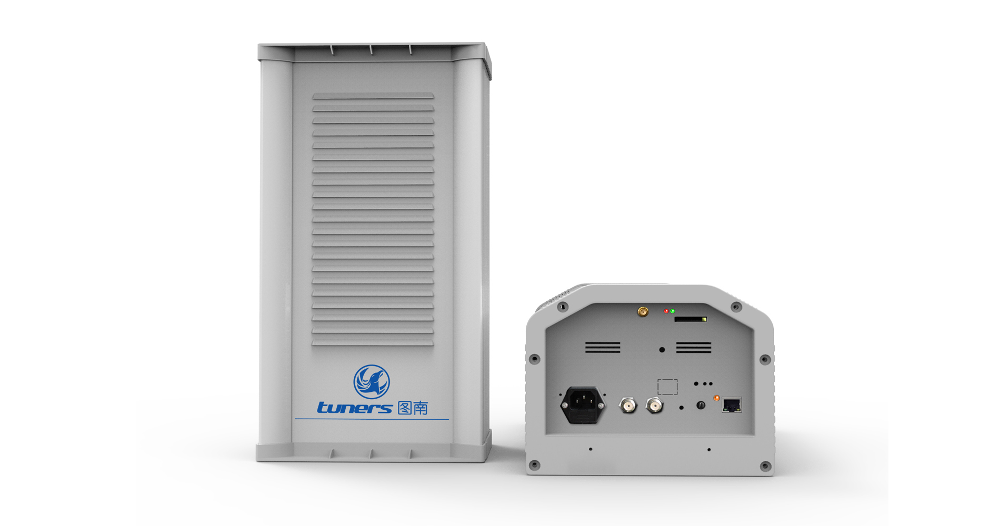

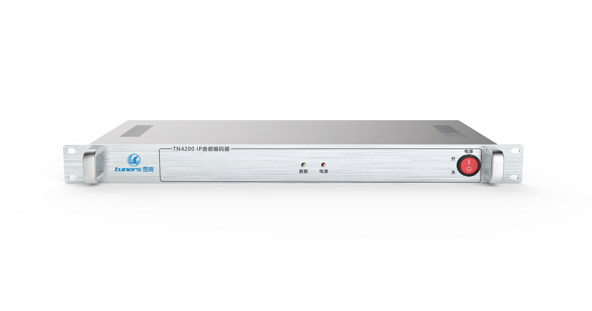

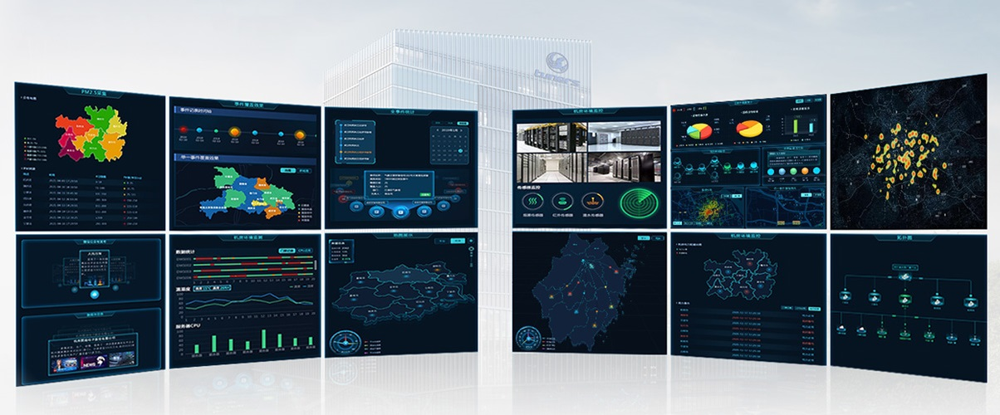

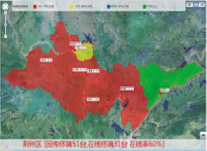

<H2>10. 布料包装系统</H2>

**项目描述：**

&emsp;&emsp;该项目主要针对原有车间布料包装生产线进行自动化改造的。通过验布人员验布并确认布的质量，录入到系统中然后上线到包装线，服务端接收到4条生产线的上线布料信息累积起来，当某条生产线某个批次达到整箱包装要求时，服务端通知PLC某条线上线布料进行包装，并打印布料整箱信息，PLC接收指令，每上一个布料卷就通知服务端打印对应布料的二维码，PLC接收到二维码打印成功的消息后包装布料并自动把二维码贴在布料上，当包装完整箱后，线上系统的机器人接收服务端传过来的布料整箱消息进行打包和封装，并把包装好的箱子传送到码垛机器旁，码垛机接收到到位开关消息和整箱的生产线号数据分配码垛，服务端接收到码垛完成整垛信息后打印对应清单。

**开发环境：**

- 开发工具：C# VS2022
- 数据库：MySQL，Dapper等
- 部署环境：Windows server 2008服务器

**项目职责：**

- 1.负责服务软件开发。

- 2.负责部署网络配置，协助PLC工程师调试连通。

- 3.客户端软件的开发，仓库管理软件开发。
	       
**项目业绩：**

&emsp;&emsp;成功应用到客户生产中，将原来手工包装布料自动化，信息化，方便追溯记录。

**项目UI：**

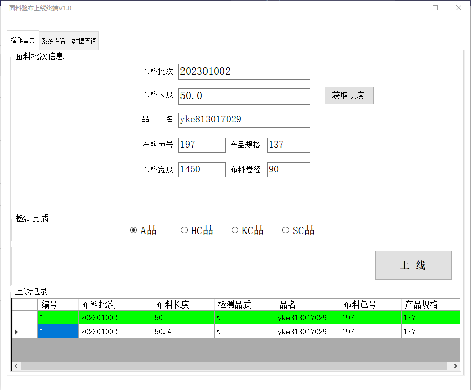

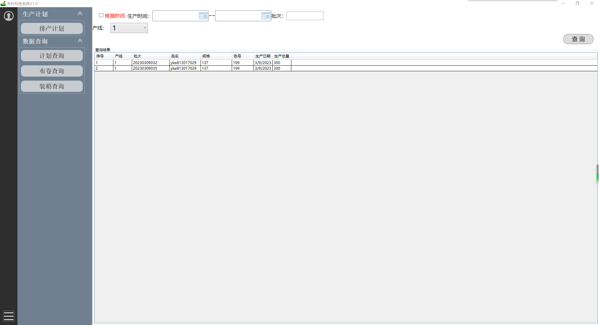

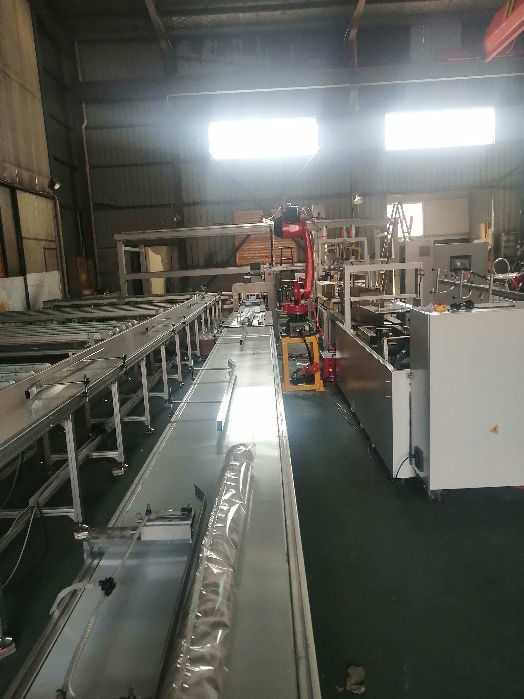

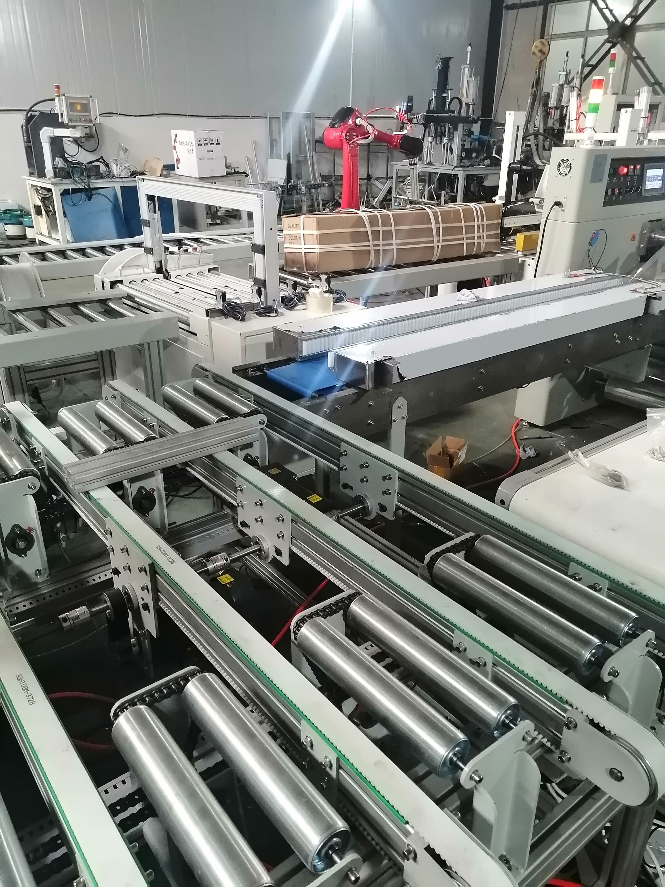

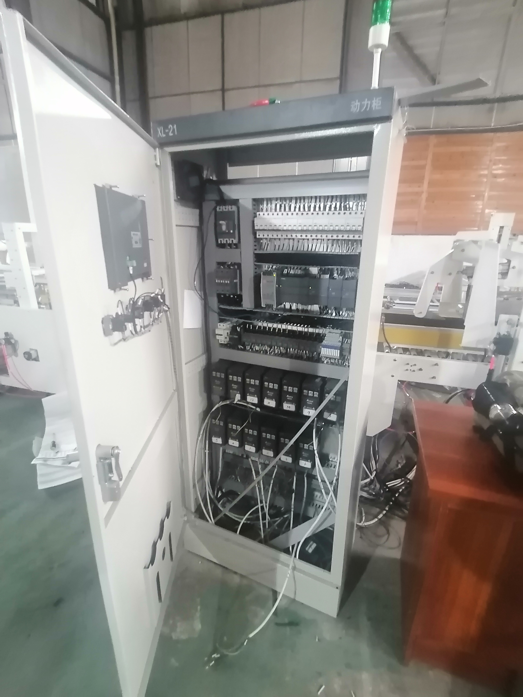

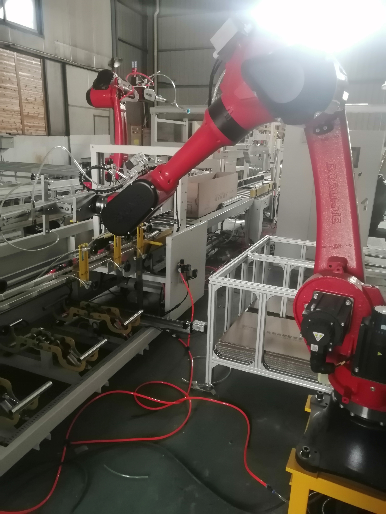

<H2>11. 黑电台监控系统</H2>

**项目描述：**

&emsp;&emsp;该项目主要是针对城市区域内一些非法电台的。通过在城市区域内投放监控设备，并在地图组件上显示(Gmap.Net)，设备采集各个频道的频谱数据和音频数据，监听播放PCM流数据；使用4G模块通过TCP上传到服务端，服务端解析频谱数据分析异常并保存，同时另一服务监听音频，使用语音转文字(科大讯飞)自动过虑异常信息，并在地图上显示各个点的监控状态，对产生的异常生成报警。针对这个项目，专门设计架构了一个服务端，服务端由音频处理模块，日志模块，通信模块，用户模块，业务处理模块，JSON模块等组成，业务处理模块把各个功能模块联接起来。黑电台综合网络查找系统是通过对某一城市或特定区域布置多个小型“无线电采集终端”，对广播频段进行重点监测，可以实时高效的查找非法黑电台，对查找出来的非法频率信号进行实时比对，对解调出来的音频数据进行实时记录，可快速的查找、分析并判断黑电台的存在，有效的提高了查找黑电台的技术手段，摆脱了传统监测设备的局限，有效避免传统监测设备不灵活的特性，从而将对“黑广播”侦测由被动变为主动，有效提高了工作效率。

**开发环境：**

- 开发工具：C# VS2010
- 数据库：MySQL等
- 部署环境：Windows server 2008服务器

**项目职责：**

- 1.负责服务端软件开发。

- 2.负责部署设备网络配置，以及监控设备的配置。

- 3.客户端软件的开发。
	       
**项目业绩：**

&emsp;&emsp;作为监控非法广播的服务应用于广播电视部门的探测系统，成为监测到南京某地的一些黑电台。

**项目UI：**

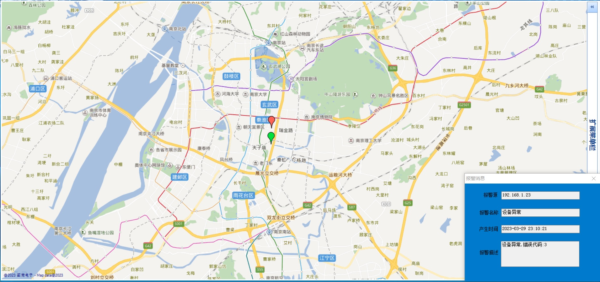

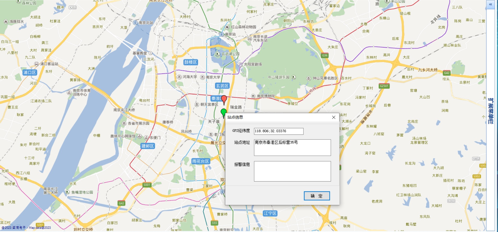

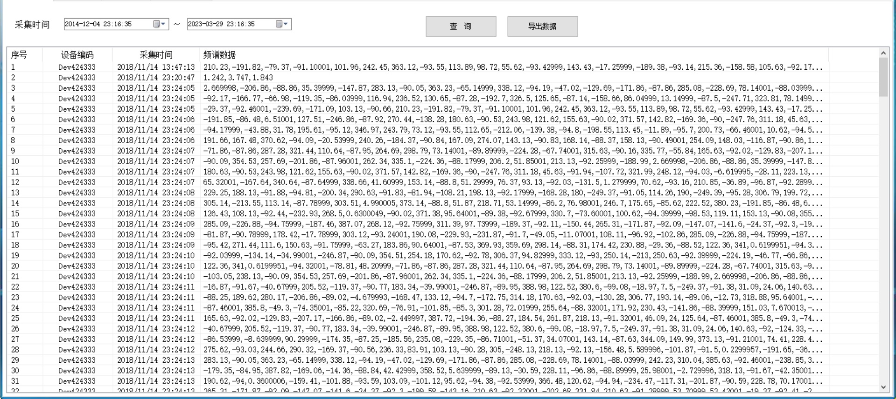

