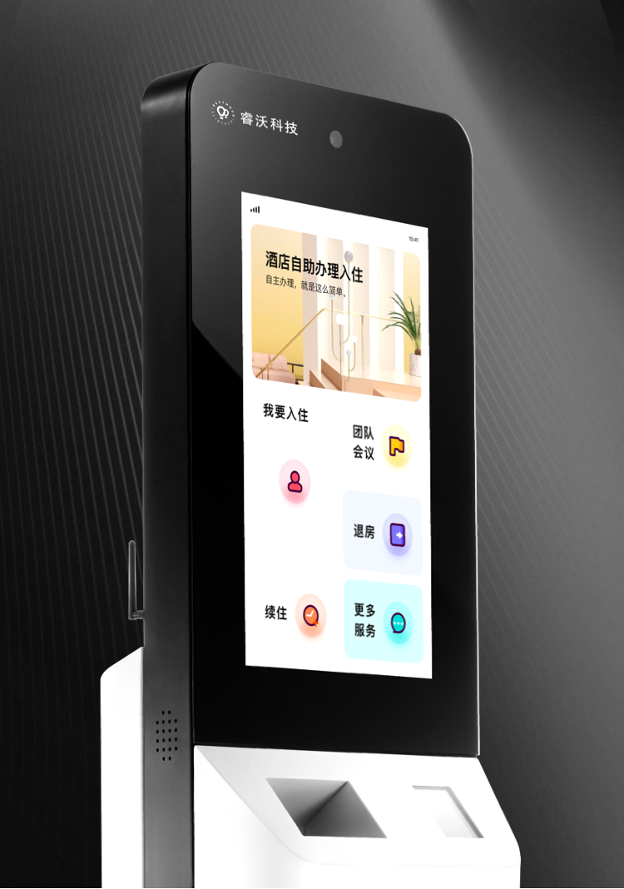
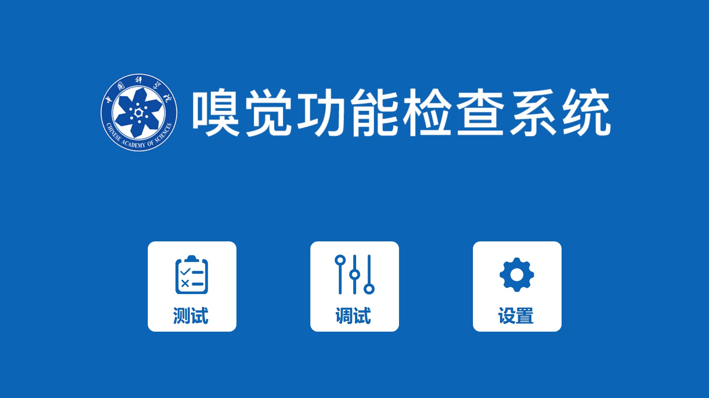

#**个人历年项目总结**

--------

<H2>1. 酒店自助机终端系统</H2>


**项目描述：**

&emsp;&emsp;该系统结合各类酒店现有PMS系统，门锁系统等实现顾客自助入住酒店系统。系统采用WPF的MVVM模式+流程引擎驱动实现顾客入住繁琐一步步操作功能，系统采用Restful风格的WebAPI，异步获取PMS接口返回的订单数据。通过配置参数获取WPF模板化并展示，并把一些常用的数据保存到Redis上，缓存一些不是需要实时查询的数据，在配置的流程通过流程驱动一步步执行，使用虹软的人证核验模块采集人证数据验证后，通过ActiveMQ把数据通知到MQ服务器以供PSB系统接收消息，在用户扫码支付宝或者微信支付后（也可以银联支付码或者银行POS机），通过硬件操作单例的发卡机接口使用工厂模式创建发卡机对象移动卡片，C#调用C++SDK执行房卡的读写，通过串口调用或者调用SDK控制发卡机把制作好的房卡发送出来，在出现异常时，把日志通过NLog发送到ELK系统上供运维人员排查参考。使用StyleCop.Analyzers进行代码整齐规范。

**项目职责：**

- 1.负责项目的总体设计，及核心技术：流程引擎的设计与实现

- 2.负责顾客无预定入住流程及退房流程的开发

- 3.负责项目中关键性技术的攻关开发及优化
	       
**项目业绩：**

- 1.与1.0版本的自助机相比，产品更可靠，外观更美观，实现了7*24小时的不间断运行

- 2.引入和使用的流程引擎提高了25%以上的开发效率

- 3.与一代产品相比，一代自助机产品日均使用率100单不到跨越到二代自助机使用率日均10000单以上，完全淘汰一代产品

**项目UI：**




<H2>2. 水质在线监测系统</H2>

**项目描述：**

&emsp;&emsp;该项目主要是针对水站安防摄像，门禁的集成，对UI进行改版。产品集成氨氮仪表，总氮，总磷等仪表(COM通信/TCP通信)，通过C#调用海康SDK的DLL控制海康监控摄像头进行巡检与抓拍录像安全异常事件，把报警发送到平台上端(JAVA开发的展示平台系统，通过TCP/UDP传输协议和环保行业国家标准协议传输到平台端)告知维护人员，集成门禁系统，使用UDP控制门禁的开关和刷卡，对非法进入进行标志，触发海康监测系统拍照保存，在测量的时候，实时获取五参数数据，并组态界面显示测量数据，本项目不仅设备实现可动态增加，UI界面也实现了可配置化和组态化，所见即所得。

**项目职责：**

- 项目经理；
- 负责UI新框架的开发；
- 协调测试人员集成自产仪器的测试工作；
- 协调开发人员开发集成其它设备；
- 协调电控设计人员进行产品控制对接。
	       
**项目业绩：**

&emsp;&emsp;上位机软件进行UI新版本的全面升级，集成海康视频安防监控系统，集成门禁系统，作为新一代产品销售，优化部分组件平台性能，以及整理成模块块方便其它项目上使用。

**项目UI：**


<H2>3. 限速器测试及打印装箱系统</H2>

**项目描述：**

&emsp;&emsp;该系统主要实现了限速器生产线自动化测试数据，设备自动存储仓库及数据上传入库提供质量报告打印出货的功能。系统通过扫描限速器上设备上的条码，获取产品的测试标准数据，获取标准测试数据后通过串口通信下达命令给西门子S7200 PLC，PLC控制转轮带动测试台对产品进行自动测试，实时采集传感器数据上传到测试软件，测试软件实时检测数据并并实时曲线显示测量数据，对不合格的数据发送指令给西门子PLC停止测量让工人调整设备工艺后重新测试，实现了数据平稳性可见，最大值，最小值易观性。测试成功后，把测量的数据通过WebAPI接口传送到ERP系统，在流到下一个工位进行拉拔力测试，可以根据客户要求进行定时，定点，拉力稳定性等多种方式测试设备的稳定性，测试完成可同时保存测试结果到ERP系统或者保存测量曲线图片。在包装装箱工位上扫码获取测量结果，测量的数据通过条码打印机打印出来，贴在产品包装箱上方便厂商跟踪，最后在流水线末端，仓储机器爪结构抓取设备，获取设备分配仓库位置，自动把设备存储在对应货架上，需要出货时在ERP系统中发出出库指令，机器爪自动依序提出设备到打包装箱流水线。目前系统已经正常运行10多年，还在作为产线主要核心正常使用。

**项目职责：**

&emsp;&emsp;负责生产线的测试数据采集软件开发，箱外标识打印软件的开发，仓储分配的算法开发及控制的开发，设备控制协议的指定。
	       
**项目业绩：**

原来生产线产量80台/人天变成120台/人天，测量数据可追溯，产品出厂质量由原来的98%变成99.99%，工厂信息化水平从0到1，实现产品信息可追溯化，标签系统方便仓库自动管理，信息化管理，目前该测试能软件已经稳定运行达10年并持续为公司生产服务。

**项目UI：**


<H2>4. 气味电影脚本编辑器</H2>

**项目描述：**

&emsp;&emsp;本系统专门为了公司气味电影产品所做的脚本编辑器，主要通过结合菜单模块控件，气味库控制，视频播放，气味脚本编辑控件，提供可视化编辑器，在播放视频时，拖动脚本到时间轴上，触发底层集成的设备自动播放对应气味，编辑完成后，导出视频与脚本提供给气味播放器播放。

**项目职责：**

- 1.负责框架结构设计，UI组件设计开发，底层设备控制模块的架构开发。

- 2.负责通信协议的制定，协助设备组装人员测试硬件性能。

- 3.负责后期结合扫码付费使用接口和摄像头采集视频识别功能的集成。

	       
**项目业绩：**

&emsp;&emsp;作为公司的最常用的工具软件和底层架构，为其它项目节省开发时间和模块的支持。

**项目UI：**


<H2>5. 气味电影播放器</H2>

**项目描述：**

&emsp;&emsp;本系统专门播放气味电影而开发的气味电影播放器，适用于各大影城播放气味电影，增加电影维度从3D到4D的过程。

**项目职责：**

- 1.负责软件的全部功能开发。

- 2.负责气味电影新版本控制器的集成。
	       
**项目业绩：**

&emsp;&emsp;作为公司的最核心产品的软件部分方便结合硬件设备成套销售或者租借的软设施。

**项目UI：**


<H2>6. 科嗅仪</H2>

**项目描述：**

&emsp;&emsp;本系统专门为中科院定制的嗅觉检测设备，根据嗅觉功能评估标准，测试评估用户的嗅觉能力，医生根据用户测试结果以及用户其它与嗅觉功能有关的生活习惯来定位用户嗅觉能力，作为嗅觉核查的参考，系统采用WPF的MVVM模式，采用RestFull风格的WebAPI接口，传输JSON格式数据和ToKen。自定义设计步骤组件，头部组件结合做题逻辑一步步按着流程步骤走，完成最终报告，然后提供报表打印功能。

**项目职责：**

- 1.负责软件的全部功能开发。

- 2.负责与中科院功能需求的对接。

- 3.负责与平台端的对接接口数据。
	       
**项目业绩：**

&emsp;&emsp;作为公司第一次与中科院合作的产品，也是第一次进入医疗相关的领域有很大的意义，目前已经有部分产品已经使用中，也是作为中科院研究的辅助器材，对于个人来说是医疗领域的自助机开发。

**项目UI：**





<H2>6. 科嗅仪娱乐版--气味游戏机</H2>

**项目描述：**

&emsp;&emsp;本系统是根据科嗅仪改版而成，旨在为大众简单的了解下自己嗅觉能力，作为嗅觉能力的参考，主要作为娱乐器材之用。系统采用WPF的MVVM模式，采用RestFull风格的WebAPI接口，传输JSON格式数据。自定义设计步骤组件，头部组件结合做题逻辑一步步按着流程步骤走，完成最终报告，显示报告二维码供用户分享到朋友圈。

**项目职责：**

- 1.负责软件的UI开发。

- 2.负责设备集成与业务逻辑开发。

- 3.负责排名等算法的设计。
	       
**项目业绩：**

&emsp;&emsp;作为公司展厅比较吸引顾客的一个项目，是用户度最集中喜爱的一个项目。

**项目UI：**


<H2>7. 空调零件装配检测系统</H2>

**项目描述：**

&emsp;&emsp;本系统为工厂生产空调工艺防止少装漏装零件的监控系统，通过PLC采集每个零件的二维码，每个工位安装的顺序和工序零件，在生产完全时判断是否有漏装或者错装的零件，并生成二维码，方便用户追溯以及信息化管理，其中每个工位至少有个PLC，一个工位可以安装多个零件或者多道工序，通过在系统配置生成每条生产线需要安装的零件和每个工位需要处理的工艺，完成设备总装检测。

**项目职责：**

- 1.负责服务端的开发，PLC设备的集成。

- 2.负责工位工艺配置逻辑业务的开发以及数据的查询。
	       
**项目业绩：**

&emsp;&emsp;已经正常运行5年，监控生产运行100万台以上空调，方便车间工厂改动工序和追溯产品相关信息。

**项目UI：**


<H2>8. 气味涡环炮</H2>

**项目描述：**

&emsp;&emsp;本系统通过摄像头捕捉人脸(目前使用Caffe模型提高了人脸识别准确度，能适应比较差的环境)，根据人脸(多个人脸时锁定距离近，识别度比较高的的一个)对应在摄像头位置发送指令调整机器对准人脸，不断校准人物所在摄像头方位，计算分析出目标比较稳定时发送指令控制设备生成气味涡环，喷发具有涡环状的气味来吸引经过店铺门口的用户。

**项目职责：**

- 1.负责人脸识别，定位算法，设备控制的开发。

- 2.负责第二版本技术原理改进优化及部署设计。
	       
**项目业绩：**

&emsp;&emsp;作为公司的最核心产品之一，新开发产品中唯一有专利权的项目，在展会上吸引很多用户的青睐。

**项目UI：**


<H2>9. IP广播系统</H2>

**项目描述：**

&emsp;&emsp;本系统是与。

**项目职责：**

- 1.负责软件的全部功能开发。

- 2.负责气味电影新版本控制器的集成。
	       
**项目业绩：**

&emsp;&emsp;作为公司的最核心产品的软件部分方便结合硬件设备成套销售或者租借的软设施。

**项目UI：**


1. 斜体和粗体

使用 * 和 ** 表示斜体和粗体。

示例： *斜体* ，**粗体**


2. 分级标题

在想要设置为标题的文字前面加#来表示，注：标准语法一般在#后跟个空格再写文字，貌似简书不加空格也行，使用H标签也可以。
示例：

# 这是一级

## 这是二级

### 这是三级

#### 这是四级

##### 这是五级

###### 这是六级

<H1>这是一级</H1>

<H2>这是二级</H2>

<H3>这是三级</H3>

<H4>这是四级</H4>

<H5>这是五级</H5>

<H6>这是六级</H6>


3. 斜体加粗及删除线

要倾斜和加粗的文字左右分别用三个*号包起来，要加删除线的文字左右分别用两个~~号包起来，示例：

**这是加粗的文字**

*这是倾斜的文字*` 

***这是斜体加粗的文字*** 

~~这是加删除线的文字~~ 


4. 引用

在引用的文字前加>即可。引用也可以嵌套，如加两个>>三个>>>
n个...

>这是引用的内容

>>这是引用的内容


5. 分割线
三个或者三个以上的 - 或者 * 都可以。示例：

---

----

***

*****


6. 图片

语法：


图片alt就是显示在图片下面的文字，相当于对图片内容的解释。
图片title是图片的标题，当鼠标移到图片上时显示的内容。title可加可不加


7. 超链接

语法：

[超链接名](超链接地址 "超链接title")，title可加可不加

[简书](http://jianshu.com)

[百度](http://baidu.com)

<a href="https://www.jianshu.com/u/1f5ac0cf6a8b" target="_blank">我的简书</a>


8. 列表

*无序列表*

语法：
无序列表用 - + * 任何一种都可以，可用tab 或者空格 + -、+ 或者 * +文字内容使列表嵌套示例：

- 第一层列表内容1
	* 第二层1
	* 第二层2
		- 第三层1
		- 第三层2
+ 第一层列表内容2
	* 第二层21
* 第一层列表内容3
	- 第二层31

注意：-+* 跟内容之间都要有一个空格

*有序列表*

语法：数字加点，示例：

1. 列表内容
2. 列表内容
3. 列表内容

***注意：序号跟内容之间要有空格***

9. 列表嵌套

上一级和下一级之间敲三个空格即可，示例：

- 一级无序列表内容

   二级无序列表内容
   
   二级无序列表内容
   
+ 一级无序列表内容

10. 表格
语法：

表头|表头|表头
---|:--:|---:
内容|内容|内容
内容|内容|内容

第二行分割表头和内容。
- 有一个就行，为了对齐，多加了几个
文字默认居左
-两边加：表示文字居中
-右边加：表示文字居右
注：原生的语法两边都要用 | 包起来。此处省略

姓名|技能|排行
--|:--:|--:
刘备|哭|大哥
关羽|打|二哥
张飞|骂|三弟

11. 代码

语法：单行代码：代码之间分别用一个反引号包起来

`代码内容`
示例
```
    function fun(){
         echo "这是一句非常牛逼的代码";
    }
    
    fun();
```

    这是一个代码块，此行左侧有四个不可见的空格。


12. 流程图 部分支持

```flow

st=>start: 开始

op=>operation: My Operation

cond=>condition: Yes or No?

e=>end

st->op->cond

cond(yes)->e

cond(no)->op

&```


13. 标签分类

在编辑区任意行的列首位置输入以下代码给文稿标签：

标签： 数学 英语 Markdown

或者

Tags： 数学 英语 Markdown


14. 超链接

自动超链接 语法：

<http://example.com/>

引用式链接 语法：

[link1]:http://www.baidu.com/ 

[引用式链接例子《就是外在文字》][link1]

引用式链接-简化语法：

[百度][]

[百度]: http://google.com/


15. 带有链接的图片

[](http://www.baidu.com/ "链接说明文字")

引用式图片引用

[link2]:https://www.baidu.com/img/pcdoodle_2a77789e1a67227122be09c5be16fe46.png "其实就是HTML 的<a> 标签的 Title 属性"
![引用式图片链接例子《就是Alt属性》][link2]

16. HTML引用

<b>加粗</b>

<strong>加粗</strong>

<i>倾斜</i>

<em>倾斜</em>

<u>下划线</u>

<ins>下划线</ins>

<s>删除线</s>

<del>删除线</del>

这是<sub>下标</sub>

这是<sup>上标</sup>

<b style=“font-size:80px; color:red”>加粗</b>


17. Todo List

-/+/*+空格+[+空格/x+] +空格+文字内容；示例：

- [ ] 待办事项
- [x] 已完成的待办事项
+ [v] 正在处理

18. 脚注

在文档末尾写上[+^+数字+]:+文字内容 声明一个脚注
然后就跟文献引用一样，在要引用该脚注的文字后插入[+^+数字+]即可

该方法根据实验证明有效[^1]
[^1]:文章链接

